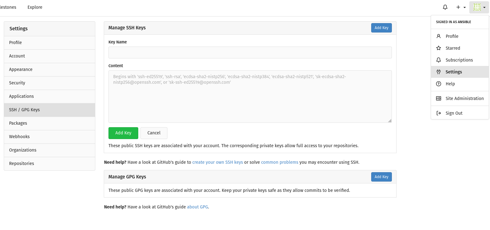

In this lab, we set up our own git repository with [Gitea](https://about.gitea.com/) for later use.
Basic knowledge of [git](https://git-scm.com) is supposed.
If you are not familiar with git, you can learn everything about it here:
[https://git-scm.com/book/en/v2](https://git-scm.com/book/en/v2)

There is also extensive documentation of Gitea available at [https://docs.gitea.com/](https://docs.gitea.com/).

### Task 1

Login to gitea at `https://control0.example.com:4000` and create your own repository `techlab`.

{}

* Navigate your webbrowser to `https://control0.example.com:4000` . Be sure to use port 4000.
* In the upper right corner click on `Sign In`.
* Enter your username and password provided by the teacher. Then click the green button `Sign In`.
* Click on the `+` sign to the right of `Repostories`.
* Enter `techlab` as repository name and click `create repository`.

{}

### Task 2

Now we initialize the `/home/ansible/techlab` folder as a local git repository and add the gitea repository
created in Task 1 as its remote.
We also do some basic git configurations.

* On the controller server go to the techlab folder
* Config `main` as the default branch
* Config your name and email
* Init a git repo in the `/home/ansible/techlab` folder
* Add your gitea repository as an ssh-remote
(the remote SSH user is gitea, so `gitea@<yourname>-controller.workshop.puzzle.ch:ansible/techlab.git`
is what you have to set as a remote).
* Create a `README.md` file with a description of your repository
* Add and commit the file `README.md` with an appropriate commit message.
* Don't push your changes yet

{}

```
cd /home/ansible/techlab
git config --global init.defaultBranch main
git config --global user.email "you@example.com"
git config --global user.name "Your Name"
git init
git remote add origin gitea@control0.example.com:ansible/techlab.git
echo "This is my Ansible Techlab repo" > README.md
git add README.md
git commit -m "first commit"
```

{}

### Task 3

* In Task 2 of Lab 1.0 you created SSH keys for the user ansible on controller node
* Show the content of the SSH public key
* In the Gitea GUI, navigate to the `Settings` of the user `ansible`
* On the right side chose the `SSH / GPG Keys` tab
* Click the `Add Key` button
* Set `ansible@control0.example.com` as `Key Name` and paste the content of your public key in the `Content` field of the GUI
* Click `Add Key`

{}

```
cat /home/ansible/.ssh/id_ed25519.pub
```



{}

### Task 4

* Push your changes and set the upstream to `origin main`
* In the Gitea GUI, check that your changes have been pushed to the remote.

{}

```
git push --set-upstream origin main
```

(If you push for the first time,
check and then accept the controllers authenticity by entering `yes` followed by `<ENTER>`)

{}
