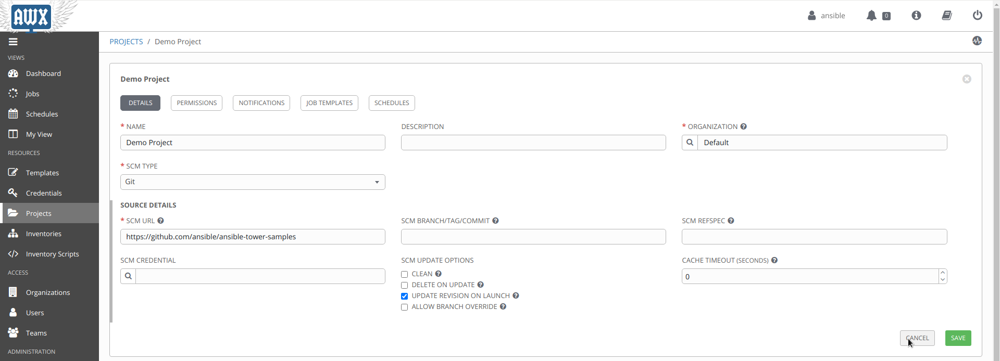
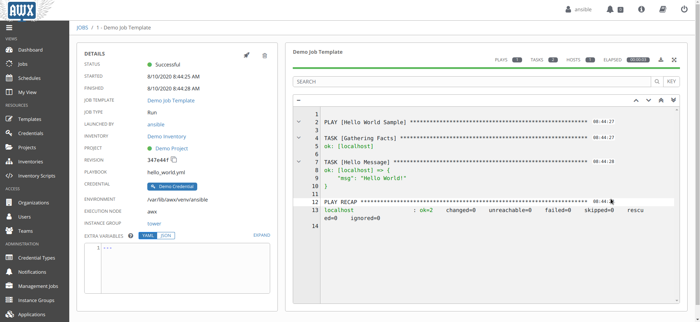
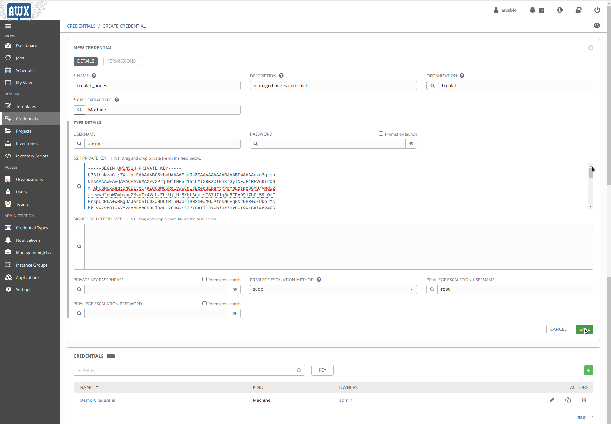
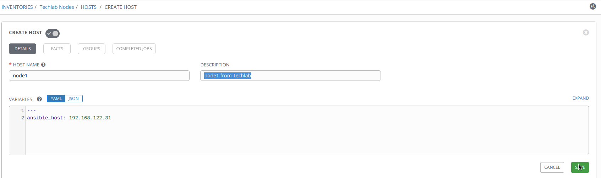
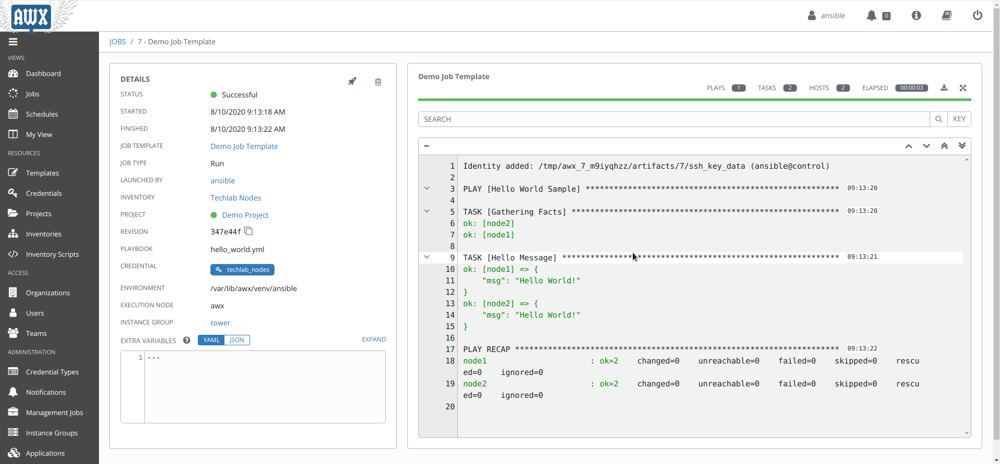

In this lab we are working with AWX

### Task 1

* Get an Overview of the AWX Web GUI.
* For security reasons you should change the admin password.
* Find out where that password can be changed.

### Task 2

* Add a organization named "Techlab".
* Add a User `ansible` that belongs to the Techlab organization.
* `ansible` should belong to the AWX role "System Admnistrator".
* Log out form AWX web GUI.
* Log in to AWX web GUI as `ansible`

### Task 3

* The AWX installation comes with a "Demo Project" and a "Demo Job Template"
* Take a look at the definition of Demo Projekt: This project links to a git repository on GitHup with [an example playbook](https://github.com/ansible/ansible-tower-samples).
* Take a look at Demo Job Template. This template can be used to run the playbook `hello_world.yml` from that GitHub repository.
* Execute that playbook by klicking on the rocket symbol. It shoud run without errors print "hello world".

### Task 4

* Try to run hello_world on `node1` and `node2`:
  * You should create credentials within AWX that allow for SSH login as `ansible` user to `node1` and `node2`.
  * Use the existing SSH private key from `~ansible/.ssh/` on `control0`.
  * You should also create an inventory within AWX that contains `node1` and `node2`.
  * Modify Demo Job Template or create a new template that runs `hello_world.yml` (from Demo Project) with your newly created credentials and inventory.

## Solutions

{}

{}

{}

{}

{}

{}

{}

{}

