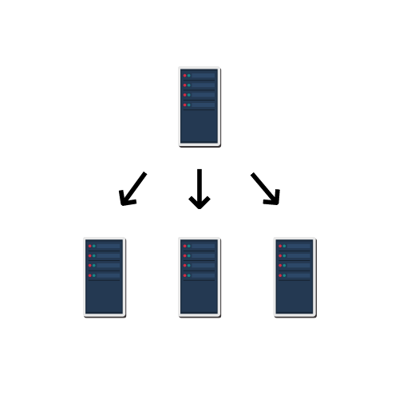
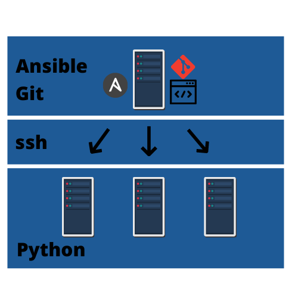
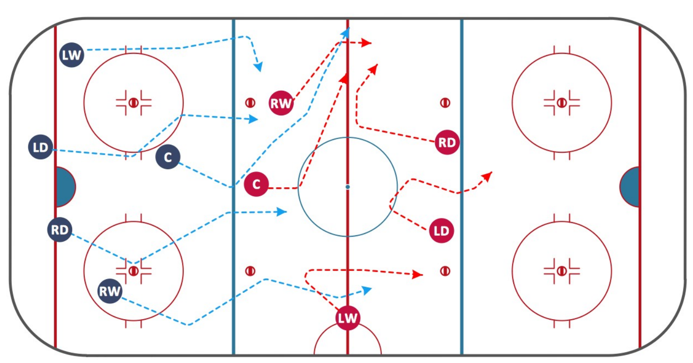
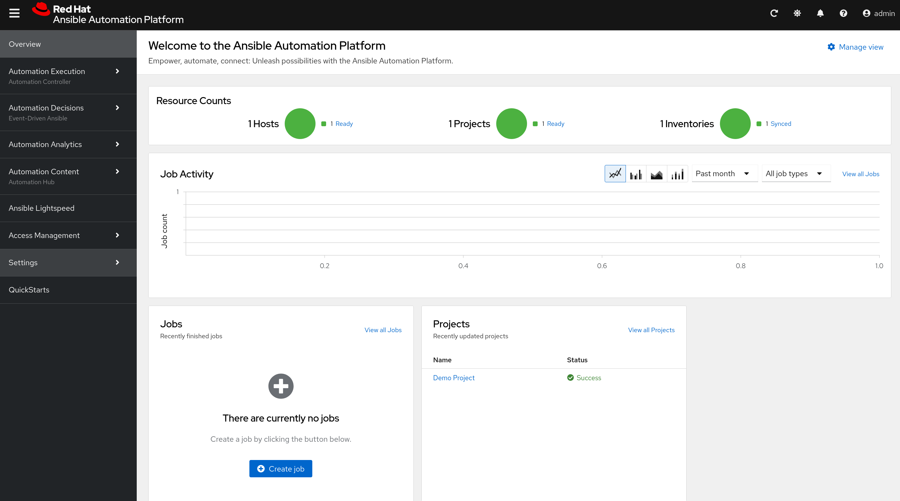

---
index:
  title: Ansible-Schulung
slides:
  separator_notes: "^Notes?:"
  separator_vertical: ^#----*$$  # nach unten
  separator: ^#====*$            # rechts/links
  theme: https://puzzle.github.io/pitc-revealjs-theme/2/puzzle.css
  favicon: img/favicon.png

revealjs:
  transition: slide
  width: 1280 # adjust if needed, e.g. for 4:3 screens
  height: 720 # adjust if needed, e.g. for 4:3 screens
  center: false
  markdown:
    breaks: true
  controls: true
  progress: true
  help: true
  autoPlayMedia: true

---

<!-- .slide: class="l-cover" -->

# Ansible
# *Puzzle ITC*
## Ansible-Schulung

> Schulungsleiter
> training@puzzle.ch

#------------------------------------------------------------------------------

<!-- .slide: class="l-team l-icons--big" -->

# Nice to meet you
- 
  - Schulungsleiter
  -  #### training@puzzle.ch

### Alle Puzzlers
#### https://www.puzzle.ch/de/team

<!-- .slide: class="l-team l-icons--big" -->

#------------------------------------------------------------------------------
# Vorstellungsrunde

Job?
Ansible?
Hobbys?

<!-- .slide: class="l-team l-icons--big" -->

#------------------------------------------------------------------------------

<!-- .slide: class="l-team l-icons--big" -->

# Organisatorisches

Fragen jederzeit stellen!

#==============================================================================

<!-- .slide: class="l-agenda" -->
# Agenda

- <a href="#einführung" src="einführung">Einführung</a>
- <a href="#grundlegendes" src="grundlegendes">Grundlegendes</a>
- <a href="#hilfe-erhalten" src="hilfe-erhalten">Hilfe erhalten</a>
- <a href="#ad-hoc-befehle" src="ad-hoc-befehle">Ad-hoc-Befehle</a>
- <a href="#playbooks" src="playbooks">Playbooks</a>
- <a href="#rollen" src="rollen">Rollen</a>
- <a href="#ansible-vault" src="ansible-vault">Ansible-Vault</a>

#------------------------------------------------------------------------------

# Agenda

- <a href="#cicd-pipelines-demo" src="cicd-pipelines-demo">CI/CD Pipelines Demo</a>
- <a href="#collections" src="collections">Collections</a>
- <a href="#ansible-navigator" src="ansible-navigator">Ansible-Navigator</a>
- <a href="#ansible-automation-platform" src="ansible-automation-platform">Ansible Automation Platform</a>
- <a href="#event-driven-ansible" src="event-driven-ansible">Event-Driven Ansible</a>
- <a href="#automatisiertes-testen" src="automatisiertes-testen">Automatisiertes Testen</a>
- <a href="#bewährte-praktiken" src="bewährte-praktiken">Bewährte Praktiken</a>
- <a href="#do-it-yourself" src="do-it-yourself">Do it yourself!</a>

<!-- .slide: class="l-agenda" -->

#==============================================================================

<!-- .slide: class="l-agenda" -->

# Labs

- Aufgaben und Lösungen (https://ansible.puzzle.ch/)

- Tipps:
  - Immer zuerst alle Aufgaben einer Übung lesen
  - Erledigt die Aufgaben nacheinander (sie bauen aufeinander auf)
  - Die Übungen werden schnell schwieriger!
  - Einige sind sehr schwierig!
  - Ihr müsst nicht alle Übungen machen, um den Inhalt zu verstehen
  - Lest „All done?“ für weitere Inhalte

#------------------------------------------------------------------------------

<!-- .slide: class="l-agenda" -->

# Labs

- Login in Lab-Umgebung:

  1. Per Secure-Shell (SSH)
  2. Alternativ: Theia-IDE auf Controller: `https://<dns-name>`

- Zugangsdaten zu Lab-Umgebung erhaltet ihr separat
#==============================================================================

<!-- .slide: class="l-agenda" -->

# Einführung

#------------------------------------------------------------------------------

## Ansible @Puzzle ITC
- Techlab-Setup
- Testinfrastruktur
    + Virtualisierung
    + Kubernetes
    + LDAP, IdM
    + SSO
    + Ansible-Plattform
- BigBlueButton
- Backup-System
<div class="logo-ansible" >

</div>

<!-- .slide: class="l-agenda" -->

Note: Eure Lab-VMs werden vollautomatisch mit Ansible erstellt und verwaltet


#------------------------------------------------------------------------------
<!-- .slide: class="l-agenda" -->

## Ansible history

- 1966 Ursula K.Le Guin „Rocannon's World“ → instant communication system
- 2012 Michael DeHaan (Cobbler, Puppet)
- 2015 Red Hat kauft Ansible Inc.
- 2019 Ansible 2.9
- 2020-08-13 Ansible-Base 2.10
- 2021-02-18 Ansible 3.0

#------------------------------------------------------------------------------

## Rocannon's World

<!-- .slide: class="l-agenda" -->
<div class="rocannons world" text-align="right">
You remember the ansible, the big machine I showed you in the ship, which can speak instantly to other worlds,
with no loss of years—it was that that they were after, I expect.
It was only bad luck that my friends were all at the ship with it.
Without it I can do nothing.
</div>


#------------------------------------------------------------------------------
<!-- .slide: class="l-agenda" -->

## Ansible-Versionen

- Ansible 2.9   -->   **one thing!** (Collections as preview)
- Ansible 2.10  -->   Ansible-Base 2.10 + Collections
- Ansible 2.11  -->   **(not available, naming changes to Ansible 3.0)**
- Ansible 3.0   -->   Ansible-Core 2.10 + Collections v3
- Ansible 4.0   -->   Ansible-Core 2.11 + Collections v4
- [..]
- Ansible 10.0  -->   Ansible-Core 2.17 + Collections v10
- Ansible 11.0  -->   Ansible-Core 2.18 + Collections v11 **(Current, not working with EL8)**
- Ansible 12.0  -->   Ansible-Core 2.19 + Collections v12 **(In development, unreleased)**

#==============================================================================

<!-- .slide: class="l-agenda" -->

# Grundlegendes

#------------------------------------------------------------------------------
<!-- .slide: class="l-agenda" -->
## Wie funktioniert das?



#------------------------------------------------------------------------------
<!-- .slide: class="l-agenda" -->
## Wie funktioniert das?



Note:
> SSH to managed node
> Copy python script (/tmp)
> Run python script
> Delete python script
> python2 or python3

#------------------------------------------------------------------------------

## Wie funktioniert das?

+ Übliches Ansible-Setup in Linux-Umgebung
  * Ein *Control Node*
    - Ansible installiert (neuere Version mittels `pip`)
    - Gut zu haben: AWX / AAP / CI/CD-Pipeline
  * Mehrere *Managed Nodes*
    - SSH, Python
  * Pull- oder Push?

+ Windows Managed Nodes
    * OpenSSH oder WinRM
<!-- .slide: class="l-agenda" -->

Note:
> Zentraler Control Node erleichtert...
> ... das Auswerten von Logs im Team
> ... Vermeidung von konkurrierenden Playbook-Runs
> ... Sicherstellung der Code-Integrität durch Verwendung zentraler Repositories
> Pull (analog zu Puppet) vs. Push (Ansible Way)
> Push braucht weder Daemon noch sonst was.
> Für reproduzierbare Ergebnisse: Execution Environments (EEs) (später...)

#------------------------------------------------------------------------------
<!-- .slide: class="l-agenda" -->
## Wie verbindet sich Ansible auf die Managed Nodes?

+ Verschiedene *Connection*-Mechanismen, unter anderem:
    * `ansible.builtin.ssh`
    * `ansible.builtin.local`,
    * `ansible.builtin.winrm`,
    * `containers.podman.podman`,
    * `kubernetes.core.kubectl`
    * etc.

Note:
> - Über Connection Plugins erweiterbar
> - Nutze `ansible-doc -t connection -l` für komplette Übersicht`

#------------------------------------------------------------------------------
<!-- .slide: class="l-agenda" -->
## Wie arbeitet Ansible auf den Managed Nodes mit erhöhten Rechten?

+ Verschiedene *Become*-Mechanismen, unter anderem:
    * `ansible.builtin.sudo`
    * `community.general.dzdo`,
    * `community.general.pbrun`,
    * `ansible.builtin.su`,
    * etc.

Note:
> - Über Become Plugins erweiterbar
> - Nutze `ansible-doc -t become -l` für eine komplette Übersicht`

#------------------------------------------------------------------------------
<!-- .slide: class="l-agenda" -->
## Wie arbeitet Ansible auf den Managed Nodes

+ Verschiedene *Module*, unter anderem:

    * `ansible.builtin.ping`
    * `ansible.builtin.setup`
    * `ansible.builtin.dnf`
    * `ansible.builtin.systemd`
    * `ansible.builtin.copy`
    * `ansible.builtin.reboot`
    * `ansible.posix.firewalld`
    * `ansible.builtin.command`
    * etc.

Note:
> - Über Plugins erweiterbar
> - Nutze `ansible-doc -l` für eine komplette Übersicht`


#------------------------------------------------------------------------------
<!-- .slide: class="l-agenda" -->
## Woher kennt Ansible seine Managed Nodes

+ *Ansible-Inventories*
+ Beispiele:
  * Statische Inventories
    - INI-Dateien (`ansible.builtin.ini`)
    - YAML-Dateien (`ansible.builtin.yaml`)
  * Dynamische Inventories aus VM- oder Cloud-Infrastrukturen:
    - `vmware.vmware.vms`
    - `cloudscale_ch.cloud.inventory`
    - `azure.azcollection.azure_rm`
  * Ausführbare Skripte (`ansible.builtin.script`)
+ Weitere Möglichkeiten in Inventories:
  * Gruppen
  * Variablen

Note:
> - Über Inventory Plugins erweiterbar
> - Nutze `ansible-doc -t inventory -l` für eine komplette Übersicht`
> - Statt `script` besser eigenes Inventory Plugin entwickeln
> - `ansible.builtin.host_list` für Inventories auf der Kommandozeile

----


 


#------------------------------------------------------------------------------

<!-- .slide: class="l-agenda" -->
## Warum Ansible?

- Ansible ist das Standardwerkzeug für Automatisierung und Orchestrierung
- Einfache Einrichtung (`dnf/apt/pip install ansible`)
- Agentless/Standardtransportprotokolle (SSH/WinRM)
- (relativ) einfache Syntax dank YAML
- Viele Module (~~2834~~, ~~3387~~, ~~4573~~, ∞ )
- Viele Zielsysteme (Linux, Windows, Netzwerkgeräte, REST-APIs)

#------------------------------------------------------------------------------
<!-- .slide: class="l-agenda" -->

## Warum Kühe?
```
__________________
< PLAY [localhost] >
 ------------------
        \   ^__^
         \  (oo)\_______
            (__)\       )\/\
                ||----w |
                ||     ||
```

- Programm „cowsay“
- Standardkonfiguration übergeben
- → Ansibull → The Bullhorn
- Kann immer noch aktiviert werden:

```
$ ANSIBLE_NOCOWS=0 ansible-playbook plays/site.yml
```

#------------------------------------------------------------------------------

<!-- .slide: class="l-agenda" -->
## Was verwenden wir auf der Kommandozeile?

- `ansible` (ad hoc execution)
- `ansible-playbook`
- `ansible-doc`
- `ansible-vault` (Verwaltung von Secrets)
- `ansible-config`
- `ansible-galaxy` (Verwaltung von roles/collection)
- `ansible-inventory`
- `ansible-lint` (Syntaxüberprüfung)
- `ansible-pull`
- `ansible-navigator`

#------------------------------------------------------------------------------

<!-- .slide: class="l-agenda" -->
## Wichtige Teile

1. Inventories
2. Konfiguration `ansible.cfg`
3. SSH-Keys
4. Bewährtes Verfahren: user `ansible` + `sudo`

#------------------------------------------------------------------------------
<!-- .slide: class="l-agenda" -->
## Datenstrukturen mit *YAML* und *JSON*

#### YAML

```yaml
---
execution:
- concurrency: 10
  hold-for: 5m
  ramp-up: 2m
  scenario: yaml_example

scenarios:
  yaml_example:
    retrieve-resources: false
    requests:
      - https://example.com/

reporting:
- module: final-stats
- module: console

settings:
  check-interval: 5s
  default-executor: jmeter

provisioning: local
```

#------------------------------------------------------------------------------

<!-- .slide: class="l-agenda" -->
## Datenstrukturen mit *YAML* und *JSON*

#### JSON

```json
{
    "execution": [
        {
            "concurrency": 10,
            "hold-for": "5m",
            "ramp-up": "2m",
            "scenario": "json_example"
        }
    ],
    "scenarios": {
        "json_example": {
            "retrieve-resources": false,
                "requests": [
                    "http://example.com/"
                ]
        }
    },
    "reporting": [
        {
            "module": "final-stats"
        },
        {
            "module": "console"
        }
    ],
    "settings": {
        "check-interval": "5s",
        "default-executor": "jmeter"
    },
    "provisioning": "local"
}
```

#------------------------------------------------------------------------------

<!-- .slide: class="l-agenda" -->

## Diskussion zur Security

* Für die Sicherheit der Ansible-Connection sorgen andere:
  - OpenSSH
  - WinRM
  - etc.
* Malware im Ansible-Code?
  - Code Reviews dank Open Source
* Zertifizierter Ansible Code z.B. durch Red Hat
* Erhöhte Privilegien (Become) nur selten nötig

Note:
> Mechanismen bei SSH (Pubkey vs. Passwort)
> passwortloses SSH mit `ssh-copy-id`
> `StrictHostKeyChecking`?


#------------------------------------------------------------------------------

<!-- .slide: class="l-agenda" -->
## Tooling

- Linux: Wählt euren eigenen Weg!
- Windows:
  - VS Code + Git für Windows
  - WSL
- Im Enterprise-Umfeld:
  - GitLab-Runner
  - Spezialisierte Ansible-Plattformen (AAP/AWX)

 

#------------------------------------------------------------------------------

<!-- .slide: class="l-agenda" -->

## Übungsumgebung

- Linux: Wählt euren eigenen Weg!
- Theia-IDE: Kurzeinführung

#------------------------------------------------------------------------------
<!-- .slide: class="l-cover" -->

# <a href="https://ansible.puzzle.ch/docs/01/">Lab 1: Setting up Ansible</a>

#==============================================================================

<!-- .slide: class="l-cover" -->

# Hilfe erhalten

#------------------------------------------------------------------------------
<!-- .slide: class="l-agenda" -->
## Dokumentation

#### Im Internet

- https://docs.ansible.com/

#------------------------------------------------------------------------------
<!-- .slide: class="l-agenda" -->
## Dokumentation

#### Auf der Kommandozeile

- `ansible-doc -l`
- `ansible-doc <module>`
- `ansible-doc -s <module>`
- `ansible-doc -t <type>`,
  wobei `<type>` u.a.:
  + `become`
  + `inventory`
  + `lookup`
  + `module` (Default)
  + …

#------------------------------------------------------------------------------
<!-- .slide: class="l-agenda" -->
## Dokumentation

#### Im lokalen Dateisystem

- `/usr/share/doc`


#------------------------------------------------------------------------------
<!-- .slide: class="l-agenda" -->
## Tipps zur Fehlersuche

* Teste mit `--check` und`--syntax-check`
* Lies die Ausgabe!
  -  Lies die Ausgabe genau!!
* Erhöhe die Redseligkeit (Verbosity: `-vvvv`)
  - Lies die Ausgabe nochmal!
* Frag Google
* Frag die KI
* Für Fortgeschrittene: `export ANSIBLE_ENABLE_TASK_DEBUGGER=true`


#------------------------------------------------------------------------------
<!-- .slide: class="l-agenda" -->
## Häufige Fehler

#### Einrückungen

Falsch:

```yaml
- name: Install apache
  ansible.builtin.dnf:
  name: httpd
  state: installed
```
Richtig:

```yaml
- name: Install apache
  ansible.builtin.dnf:
    name: httpd
    state: installed
```

#------------------------------------------------------------------------------

<!-- .slide: class="l-agenda" -->
## Häufige Fehler

#### Quoting von Jinja2-Ausdrücken

Falsch:

```yaml
- name: Start all services
  ansible.builtin.systemd_service:
    name: {{ item }}
    state: started
  loop: "{{my_services}}"
```

Richtig:
```yaml
- name: Start all services
  ansible.builtin.systemd_service:
    name: "{{ item }}"
    state: started
  loop: "{{ my_services }}"
```

#------------------------------------------------------------------------------

## Häufige Fehler
#### Fehlende `root`-Privilegien

```yaml
become: true
```

um Pakete zu installieren, Benutzer anzulegen, usw.


#------------------------------------------------------------------------------

<!-- .slide: class="l-agenda" -->

## Fühlt ihr euch nerdy? Lest die Entwicklerdokumentation!

Dokumentation im devel-Zweig:
https://docs.ansible.com/ansible/devel/ → Lerne mehr über die Zukunft von Ansible!


#------------------------------------------------------------------------------
<!-- .slide: class="l-cover" -->

# <a href="https://ansible.puzzle.ch/docs/02/">Lab 2: Documentation</a>

#==============================================================================
<!-- .slide: class="l-cover" -->

# Ad-hoc-Befehle
### (+ inventory)

#------------------------------------------------------------------------------
<!-- .slide: class="l-agenda" -->

## Ad-hoc-Befehle
- Ausführen eines einzelnen Tasks/Moduls
- Werkzeug: `ansible`
- Zusätzliche Parameter
  - Inventory (`-i`)
  - Angabe der Managed Nodes (Hosts/Listen/Inventory-Gruppen)
  - Modul (`-m`)

#### Beispiele
 ```shell
 $ ansible -i hosts all -m ansible.builtin.ping
 ```

 ```shell
 $ ansible -i hosts all -m ansible.builtin.setup
 ```

Note:
> `ansible.builtin.setup` erstellt Facts (Variablenstruktur, die den managed node beschreibt)

#------------------------------------------------------------------------------
<!-- .slide: class="l-agenda" -->

## Ad-hoc-Befehle

####  `ansible`-Kommandozeilenparameter im Überblick

- `-m <module>`
- `-b` Ausführung mit erhöhten Privilegien (meistens `root`)
- `-i <Inventory>`
- `-C` nur Testen/keine Änderungen am Managed Node („Check Mode“)
- `-l` Limit auf Gruppen oder Hosts
- `-v` verbose (geht auch mehrfach: `-vvv`

(Siehe auch `man ansible` oder `ansible --help`)

#------------------------------------------------------------------------------
<!-- .slide: class="l-agenda" -->

## Ad-hoc-Befehle

#### Managed Nodes auf der Kommandozeile

- Viele Möglichkeiten
- Beispiele:
 ```shell
 $ ansible -i hosts 'all' ...
 ```
```shell
 $ ansible -i hosts 'node1,node2' ...
 ```
```shell
 $ ansible -i hosts 'all:!node1' ...
 ```

#------------------------------------------------------------------------------

<!-- .slide: class="l-agenda" -->

## Ad-hoc-Befehle

Weitere Beispiele:
 ```shell
$ ansible -i hosts all -b -m ansible.builtin.dnf -a "name=httpd state=present"
```

 ```shell
$ ansible -i hosts all -b -m ansible.builtin.service -a "name=httpd state=started"
```

 ```shell
$ ansible -i hosts all -a "uptime"`  # (using the default module ansible.builtin.command)
```

```shell
$ ansible -i hosts all -m ansible.builtin.shell -a "hostname; whoami"`
```

#------------------------------------------------------------------------------
<!-- .slide: class="l-agenda" -->

## Inventories

Beispiel (im INI-Format:)
```ini
[control]
control0
[web]
node1
node2
[db]
node[3:99]
```
#------------------------------------------------------------------------------
<!-- .slide: class="l-cover" -->
# <a href="https://ansible.puzzle.ch/docs/03/">Lab 3: Setup and Ad Hoc Commands</a>

#==============================================================================
<!-- .slide: class="l-cover" -->

# Playbooks
### (+ Variables + Templates)


Note:
>Kommt aus dem Eishockey: Spielablauf
>Das gleiche bei Ansible

#------------------------------------------------------------------------------
<!-- .slide: class="l-agenda" -->
## Tasks/Plays/Playbooks

- Ein *Task* ruft ein bestimmtes *Ansible-Modul* auf
  + Modul-Parameter
  + Weitere Task Keywords
- Ein *Play* ist eine Liste von Tasks
  + Liste der Managed Nodes
  + Weitere Play Keywords
- *Playbook*:
  + YAML-Datei
  + Liste von Plays

#------------------------------------------------------------------------------
<!-- .slide: class="l-agenda" -->

## Plays

> Was ist wo und wie zu tun?

Sehr einfaches Beispiel:

```yaml
---
- name: Install software on web server
  hosts: web
  tasks:
  - name: Ensure apache webserver (httpd) is installed
    ansible.builtin.dnf:
      name: httpd
      state: installed
```

- *Wo?* Auf den Managed Nodes der Inventory-Gruppe `web`
- *Was?* Sicherstellen, dass `httpd` installiert wird
- *Wie?* mit dem Modul `ansible.builtin.dnf`
- Task-Parameter im Beispiel: „`name:`“ und „`state:`“
Note:
> - Deklarativ statt imperativ („Ensure…“ statt „Install …“)
> - Die Verwendung von `name:` ist eine bewährte Praxis!
> - `ansible-lint` Möchte Großschreibung nach `name:`
> - Im Beispiel hat `name:` verschiedene Bedeutungen!

#------------------------------------------------------------------------------
<!-- .slide: class="l-agenda" -->

## Plays

Task-Parameter analog zu Ad-hoc ebenfalls möglich:

```yaml
---
- name: Install software on web server
  hosts: web
  tasks:
  - name: Ensure apache webserver (httpd) is installed
    ansible.builtin.dnf:
    dnf: name=httpd state=installed
```
- „Baby-JSON“
- Veraltete Syntax
- Keine gute Praxis!

#------------------------------------------------------------------------------
<!-- .slide: class="l-agenda" -->
## Plays


Ein wenig komplexer:

```yaml
---
- name: Manage mariadb
  hosts: database
  become: true
  tasks:
    - name: Ensure mariadb is installed
      ansible.builtin.dnf:
        name: mariadb
        state: installed
    - name: Ensure mariadb is started
      ansible.builtin.systemd_service:
        name: mariadb
        state: started
```
#------------------------------------------------------------------------------
<!-- .slide: class="l-agenda" -->

## Idempotenz

- Ansible-Module sind (meistens) *idempotent*:
  - Mehrfaches Ausführen möglich
  - Es kommt immer der gleiche Endzustand heraus
  - Ausnahmen: Module wie `ansible.builtin.command`, …!
- Auch Tasks sollen idempotent sein
  - Bei den meisten Modulen kein Problem
  - Bei Modulen wie `ansible.builtin.command` zusätzliche Maßnahmen nötig
- Auch Plays/Playbooks sollen idempotent sein
#------------------------------------------------------------------------------

<!-- .slide: class="l-cover" -->
# <a href="https://ansible.puzzle.ch/docs/04/">Lab 4. Ansible Playbooks – Basics</a>

#------------------------------------------------------------------------------
<!-- .slide: class="l-agenda" -->

## Variablen

- Ansible kann *Variablen* nutzen
- Müssen mit einem Buchstaben oder einem Unterstrich beginnen
- Wohin mit den Variablen?
  - Viele (zu viele!?) Möglichkeiten!
  - Siehe <a href="https://docs.ansible.com/ansible/latest/playbook_guide/playbooks_variables.html#variable-precedence-where-should-i-put-a-variable">Variable precedence: Where should I put a variable?</a>
  - Auf der Kommandozeile mit `-e` bzw. `--extra-vars`
  - Im Inventory
  - Im Playbook
  - In Ordnerstrukturen wie `group_vars` und `host_vars`
  - `defaults`/`vars` innerhalb von Rollen (mehr dazu später…)


Note:
> https://docs.ansible.com/ansible/latest/playbook_guide/playbooks_variables.html#variable-precedence-where-should-i-put-a-variable"

#------------------------------------------------------------------------------
<!-- .slide: class="l-agenda" -->

## Wohin mit den Variablen?

Definiert im Play:

```yaml
---
- name: Manage web server
  hosts: web
  become: true
  vars:
    my_package: nginx
  tasks:
  - name: Ensure package(s) are installed
    ansible.builtin.dnf:
      name: "{{ my_package }}"
      state: installed
```

#------------------------------------------------------------------------------
<!-- .slide: class="l-agenda" -->

## Wohin mit den Variablen?

Definiert im Task:

```yaml
---
- name: Manage web server
  hosts: web
  become: true
  tasks:
  - name: Ensure package(s) are installed
    ansible.builtin.dnf:
      name: "{{ my_package }}"
      state: installed
    vars:
      my_package: nginx
```

#------------------------------------------------------------------------------
<!-- .slide: class="l-agenda" -->

##  Wohin mit den Variablen?

Definiert auf der Kommandozeile

```shell
$ ansible-playbook myplay.yml --extra-vars my_package="nginx"
```

#------------------------------------------------------------------------------
<!-- .slide: class="l-agenda" -->

##  Wohin mit den Variablen?

Definiert in Ordnern `host_vars` und `group_vars` auf Inventory-Ebene

```shell
inventory/
├── hosts
├── group_vars/
│   └── web.yml
└── host_vars/
    └── node2.yml
```

- Name der Datei in `group_vars`/`host_vars` muss dem Node oder der Gruppe aus dem Inventory entsprechen
- Zusätzliche Ordner `host_vars` und `group_vars` auch auf Playbook-Ebene möglich

Note:
> - `-- extra-vars` haben immer Vorrang gegenüber `group_vars` and `host_vars`
> - Das sind nur einige Beispiele, Ansible bietet weitere Möglichkeiten.
> - Man sollte nicht alle angebotenen Möglichkeiten nutzen, sonst verliert man schnell den Überblick

#------------------------------------------------------------------------------
<!-- .slide: class="l-agenda" -->

## Variablen

Variablen können komplexe Datenstrukturen enthalten!

```yaml [1-8|9-14]
vm:
  - name: win1
    ip: 10.20.30.40
    ram: 24576
    partitions:
      - name: C
        size: 100G
      - name: D
        size: 60G
  - name: win2
    ip: 10.20.30.50
    ram: 24576
    partitions:
      - name: C
        size: 100G
```

#------------------------------------------------------------------------------
<!-- .slide: class="l-agenda" -->

## Spezielle Variablen

Google nach „ansible special variables“

#------------------------------------------------------------------------------
<!-- .slide: class="l-agenda" -->

## Spezielle Variablen: Magische Variablen

Ein paar Beispiele:
- `playbook_dir`: Ordner mit der Playbook-Datei
- `inventory_dir`: Ordner mit der Inventory-Datei
- `inventory_hostname`: Der Inventory-Name des aktuellen Hosts
- `group_names`: Liste der Gruppen, zu denen der aktuelle Host gehört
- `hostvars`: Alle Hosts eines Play mit ihren aktuellen Variablen
- …

#------------------------------------------------------------------------------
<!-- .slide: class="l-agenda" -->

## Spezielle Variablen: Facts

- Variablen, die den aktuellen Managed Node beschreiben
- `ansible.builtin.setup` liefert die Facts
- `gather_facts`: Boolean, regelt die Bereitstellung von Facts pro Play


#------------------------------------------------------------------------------
<!-- .slide: class="l-agenda" -->

## Bonus Level: Loops!

```yaml
- name: Ensure two services are started and enabled
  ansible.builtin.systemd_service:
    name: "{{ item }}"
    state: started
    enabled: true
  loop:
    - nginx
    - firewalld
```

Note:
> - sowohl `with_items` als auch `loop` sind erlaubt
> - Wir empfehlen `loop` statt `with_*`
> - https://docs.ansible.com/ansible/latest/user_guide/playbooks_loops.html#migrating-to-loop
> - Die Default-Loopvariable ist `item`.
> - Kann per `loop_control` und `loop_var` anders definiert werden

#------------------------------------------------------------------------------
<!-- .slide: class="l-cover" -->

# <a href="https://ansible.puzzle.ch/docs/04/01/">Lab 4.1: Ansible Playbooks – Variables and Loops</a>

#------------------------------------------------------------------------------
<!-- .slide: class="l-agenda" -->

## Templates

- Ansible nutzt an verschiedenen Stellen Jinja2
- Modul: `ansible.builtin.template`
- Dateiendung: `.j2`
- Zugriff auf Variablen: `"{{ my_variable }}"`
- Zugriff auf die gleichen Variablen wie das Play selbst
- Einfache `if`-`else`-Anweisungen, `for`-Schleifen usw.

Note:
Templates sind dazu da, um komplexe Dateien zu erstellen (Variabeln sowie `if` / `else` / `for` sind möglich)

#------------------------------------------------------------------------------
<!-- .slide: class="l-agenda" -->

## Templates

- Beispiel-Task mit `ansible.builtin.template`

```yaml
---
- name: Building /etc/hosts from template with variables
  ansible.builtin.template:
    src: hosts.j2
    dest: "/etc/hosts"
    mode: "0644"
```

- Die Datei `hosts.j2`

```jinja

{{ vm.ip }}  {{ vm.name }}

```

#------------------------------------------------------------------------------
<!-- .slide: class="l-agenda" -->

## Tags

- Nur bestimmte Teile eines Playbooks ausführen
- https://docs.ansible.com/ansible/latest/user_guide/playbooks_tags.html

Beispiel:

```yaml
- name: Manage software packages
  hosts: all
  become: true
  tasks:
    - name: Ensure ntp is installed
      ansible.builtin.dnf:
        name: ntp
        state: present
      tags: ntp
    - name: Ensure figlet is installed
      ansible.builtin.dnf:
        name: figlet
        state: present
      tags: figlet
```

Tags mittels `-t` auswählen:

```bash
$ ansible-playbook -t ntp myplaybook.yml
```


#------------------------------------------------------------------------------
<!-- .slide: class="l-cover" -->

# <a href=https://ansible.puzzle.ch/docs/04/02/>Lab 4.2 Ansible Playbooks – Templates</a>

#------------------------------------------------------------------------------
<!-- .slide: class="l-agenda" -->

## Rückgabewerte von Tasks speichern

`register` speichert den Rückgabewert eines Tasks in einer Variablen:

```yaml
- name: Save ls -lah to variable
  ansible.builtin.command:
    cmd: "ls -lah"
    chdir: /home/ansible
  register: output_var
```

Den Inhalt der Variablen mit `ansible.builtin.debug` anzeigen:


```yaml
- name: Print the variable with the 'var' argument
  ansible.builtin.debug:
    var: output_var
- name: Print the variable with the 'msg' argument
  ansible.builtin.debug:
    msg: "{{ output_var.stdout }}"
```


Beachte: Der Rückgabewert von `ansible.builtin.command` enthält `stdout`, `stderr` u.v.m.

#------------------------------------------------------------------------------
<!-- .slide: class="l-agenda" -->

## Conditionals

- „`when:`“ steuert,  unter welchen Bedingungen ein Task auszuführen ist:

```yaml
- name: Befehl nur auf 'servername1' ausführen
  ansible.builtin.command: "uptime"
  when: ansible_hostname == "servername1"   # Keine Jinja-Klammern in 'when'-Bedingungen!
```

- „`failed_when:`“ steuert, wann ein Task „failed“

```yaml
- name: schlägt fehl, wenn 'error' in stdout
  ansible.builtin.command: "grep -i error /var/log/mylog"
  register: output
  failed_when: "'error' in output.stdout"
```

- „`changed_when:`“ steuert, wann ein Task den Status „changed“ liefern soll

#------------------------------------------------------------------------------

<!-- .slide: class="l-cover" -->

# <a href="https://ansible.puzzle.ch/docs/04/03/">Lab 4.3 Ansible Playbooks – Output</a>

#------------------------------------------------------------------------------
<!-- .slide: class="l-agenda" -->

## Ansible-pull

Umgekehrte Architektur:
- Playbook und Inventory aus dem Git Repo ziehen und anwenden
- Keine lokale Konfiguration verwendet
- Git Repo obligatorisch
- Keine lokal gespeicherten Daten
- `dnf install ansible` → `ansible-pull`

Beispiel:

```bash
$ ansible-pull \
    -U https://github.com/puzzle/ansible-techlab \
    -i <inventory> \
    <playbookname.yml>
```
Default playbook: `local.yml`


#------------------------------------------------------------------------------
<!-- .slide: class="l-cover" -->
# <a href="https://ansible.puzzle.ch/docs/04/04/">Lab 4.4 Ansible-Pull</a>

#------------------------------------------------------------------------------
<!-- .slide: class="l-agenda" -->

## Task control (asynchrone Ausführung)

- „`async:`“
  + wie lange  auf die Beendigung eines Tasks warten?
  + Ad-hoc: `-B`
- „`poll:`“
  - definiert das Intervall, in dem Ansible den asynchronen Task überprüft
  + Standard: 10 Sekunden
  + Ad-hoc: `-P`
- `async` > 0  und  `poll` = 0 führt Taks im Hintergrund aus („fire and forget“)

Note:
Mit Task Kontrolle kann man definieren, wie Ansible auf die Nodes zugreift.

#------------------------------------------------------------------------------
<!-- .slide: class="l-agenda" -->

## Task control

Beispiel mit Ad-Hoc-Kommando:

```bash
$ ansible -i hosts node1 -B 10 -P 2 -m ansible.builtin.dnf -a "name=my_package state=present"
node1 | CHANGED => {
    "ansible_job_id": "j578592416817.8959",
    "changed": true,
    "finished": 1,
    "msg": "",
    "rc": 0,
    "results": [
        "Installed: my_package-1:0-1.x86_64"
    ],
    "results_file": "/root/.ansible_async/j578592416817.8959",
    "started": 1,
    ...
}
$
```

Zusätzliche Rückgabewerte:
- `started`
- `finished`
- `ansible_job_id`

#------------------------------------------------------------------------------
<!-- .slide: class="l-agenda" -->

## Task control

Beispiel Playbook-Task:

```yaml
- name: Fire and forget
  ansible.builtin.dnf:
    name: my_package
    state: installed
  async: 60
  poll: 0
```

#------------------------------------------------------------------------------
<!-- .slide: class="l-agenda" -->

## Task control

Status Abfragen

* Das Modul `ansible.builtin.async_status` ruft den Status eines Hintergrund-Taks ab
* Beispiel mit Ad-Hoc-Kommando:

```bash
$ ansible -i hosts node1 -B 10 -P 0 -m ansible.builtin.dnf -a "name=my_package state=present"
node1 | CHANGED => {
    "ansible_job_id": "j549237533609.10165",
    ...
}
$ ansible -i hosts node1 -m ansible.builtin.dnf -m ansible.builtin.async_status -a jid=j549237533609.10165
node1 | SUCCESS => {
    "ansible_job_id": "j549237533609.10165",
    "changed": false,
    "finished": 0,
    "results_file": "/root/.ansible_async/j549237533609.10165",
    "started": 1,
    ...
}
$ ansible -i hosts node1 -m ansible.builtin.dnf -m ansible.builtin.async_status -a jid=j549237533609.10165
node1 | CHANGED => {
    "ansible_job_id": "j549237533609.10165",
    "changed": true,
    "finished": 1,
    "msg": "",
    "rc": 0,
    "results": [
        "Installed: my_package-1:0-1.x86_64"
    ],
    "results_file": "/root/.ansible_async/j549237533609.10165",
    "started": 1,
    ...
}
$

```

#------------------------------------------------------------------------------
<!-- .slide: class="l-agenda" -->

## Task control

#### Batch-Size im Play mit `serial:` definieren.

Beispiel 1:

```yaml
---
- hosts: all
  serial: 5
  tasks:
    …
```

Beispiel 2:

```
---
- hosts: all
  serial:
    - 1  # First, do one host
    - 10  # After the first has completed, do ten more hosts
    - 100%  # After the first eleven hosts, do the remaining ones
  tasks:
    …
```

#------------------------------------------------------------------------------
<!-- .slide: class="l-agenda" -->

## Task control

#### `max_fail_percentage`

```yaml
---
- hosts: all
  serial: 10
  max_fail_percentage: 49
  tasks:
    …
```

* Abbruch, wenn fünf Nodes ausfallen
* Bei einem Wert von 50 würde das Play bei einem Ausfall von sechs Nodes abbrechen

#------------------------------------------------------------------------------
<!-- .slide: class="l-agenda" -->

## Task control

#### Forks steuern die Parallelität:

* Default: 5
* `ansible.cfg`:
```ini
[defaults]
forks = 30
```

* Ad-Hoc mit 50 Forks:
```bash
$ ansible all -i hosts -m ansible.builtin.ping -f 50
```

Wichtig: auf die Rechenleistung des Controllers achten!

Note:
Mit Forks könnt ihr den Control Node in die Knie zwingen


#------------------------------------------------------------------------------
<!-- .slide: class="l-agenda" -->

## Task control

#### Fakten schaffen

Beispiel:

```yaml
- hosts: all
  gather_facts: false
...
```

In `ansible.cfg`:

```ini
gathering = implicit   ## implicit (Standard), explicit oder smart
```

Im Play deaktivieren: `gather_facts: false`

#------------------------------------------------------------------------------
<!-- .slide: class="l-cover" -->
# <a href="https://ansible.puzzle.ch/docs/04/05/">Lab 4.5: Task control</a>


#------------------------------------------------------------------------------

#### Bonus Level: Ansible on Windows
Kein Windows als Ansible-Steuerungshost! cygwin etc. nicht unterstützt...
- Aber: Funktioniert auf WSL...
- gaaaaanz viele Module für win:
  + win_dienst
  + win_updates
  + win_schokoladig
  + win_shell

- Verbindung über winrm → etwas kompliziert...
- OpenSSH verfügbar als „installable feature“ auf WinServer2019 / Win10
```powershell
Add-WindowsCapability -Online -Name OpenSSH.Client~~~~0.0.1.0
Add-WindowsCapability -Online -Name OpenSSH.Server~~~~0.0.1.0
Start-Service sshd
Set-Service -Name sshd -StartupType 'Automatic'
```
#------------------------------------------------------------------------------
<!-- .slide: class="l-agenda" -->
## Bonus Level: Ansible on Network Devices
- Viele Anbieter werden unterstützt (> 490 „ios“-Module)
- SSH-Verbindung weiterhin erforderlich

#==============================================================================
<!-- .slide: class="l-cover" -->


# Rollen


### (+ galaxy + handlers + errorhandling)

#------------------------------------------------------------------------------
<!-- .slide: class="l-agenda" -->
## Rollen

 Und warum?
  - Aufgaben bündeln, Dinge wiederverwenden
  - Trennung der Belange:
    + Rollen enthalten die eigentliche Logik
    + Playbooks definieren, welche Rollen auf welchen Hosts ausgeführt werden
  - Beispiel-Rollen:
    + base
    + httpd
    + mariadb

#------------------------------------------------------------------------------

## Rollen
Beispiel (noch keine Rollen):

```yaml
---
- hosts: web
  become: true
  tasks:
    - name: Install Apache
      ansible.builtin.dnf:
        name: httpd
        state: installed
    - name: Start Apache
      ansible.builtin.systemd_service:
        name: httpd
        state: started
```

Beispiel:

```yaml
---
- hosts: web
  become: true
  roles:
    - httpd
```

#------------------------------------------------------------------------------

## Rollen
- `roles_path` in `ansible.cfg` (default `/etc/ansible/roles`)
- Definierte Ordner-Struktur (siehe später)
- Verwendet nur die Teile der Ordner-Struktur, die ihr wirklich braucht!

ansible-galaxy:
- Online-collection von Rollen (und mehr)
- https://galaxy.ansible.com/
- (Auch auf GitHub!)

Ziemlich praktisch:
```bash
ansible-galaxy role init <rolename>
```

→ Erzeugt eine Standard-Ordner-Struktur

#------------------------------------------------------------------------------

### Rollen

```
Base/
├── defaults
│ └── main.yml
├── files
├── handlers
│ └── main.yml
├── meta
│ └── main.yml
├── README.md
├── tasks
│ └── main.yml
├── templates
├── tests
│ ├── inventory
│ └── test.yml
└── vars
  └── main.yml
```


- `defaults`: Standardwerte von Variablen, falls nicht anderswo definiert
- `meta`: zusätzliche Informationen (z.B. Abhängigkeiten zu anderen Rollen)
- `test`: Tests der Rollen-Funktionalitäten
- `vars`: Variablen (Vorrang vor `group_vars`/`host_vars`)

#------------------------------------------------------------------------------
<!-- .slide: class="l-cover" -->
# Lab 5: Ansible-Rollen - Grundlagen

#------------------------------------------------------------------------------
<!-- .slide: class="l-agenda" -->

## Handler

Dinge ausführen, wenn Tasks den Zustand „changed“ melden

Beispiele:
- Neustart des Dienstes nach Änderung der Konfigurationsdatei
- Benutzerdefinierte Skripte nach Software-Upgrade
- Handler sind keine Rollenfunktion. Sie können auch in Playbooks verwendet werden.

*Welcher Handler wird ausgelöst?*
Der Wert von `notify:` im Task  muss mit dem Wert von `name:` oder `listen:` im Handlers übereinstimmen


#------------------------------------------------------------------------------
<!-- .slide: class="l-agenda" -->

## Handler

Beispiel Playbook:

```yaml [1|2-8|9-12]
---
- hosts: all
  tasks:
    - name: Write configuration file
      ansible.builtin.template:
        src: templates/sshd_config.j2
        path: /etc/ssh/sshd_config
        validate: sshd -t %s
        mode: "0644"
      notify: restart sshd
  handlers:
    - name: restart sshd
      ansible.builtin.systemd_service:
        name: sshd
        state: restarted
```


#------------------------------------------------------------------------------
<!-- .slide: class="l-agenda" -->

## Handler
Beispiel Playbook:

```yaml [8|10|13]
---
- hosts: all
  tasks:
    - name: put configuration file
      ansible.builtin.template:
        src: templates/sshd_config.j2
        path: /etc/ssh/sshd_config
        validate: sshd -t %s
        mode: "0644"
      notify: restart sshd
  handlers:
    - name: sshd restart
      ansible.builtin.systemd_service:
        name: sshd
        state: restarted
      listen: restart sshd
```

#------------------------------------------------------------------------------
<!-- .slide: class="l-agenda" -->

## Handlers

Achtung:

- Handler werden nur einmal am Ende eines Plays ausgeführt
- Oder man verwendet  "`flush_handlers`":

```yaml
- name: Run all handlers that have been triggered
  ansible.builtin.meta: flush_handlers
```

- wenn mehrere Handler den gleichen Namen haben, wird nur der letzte ausgeführt
- Aber: Jeder Handler, der einen passenden `listen` hat, wird ausgelöst
- *bewährte Praxis*: `listen:` verwenden

#------------------------------------------------------------------------------
<!-- .slide: class="l-agenda" -->

## Handlers

Beispiel:

```yaml
handlers:
  - name: "restart web services"
    ansible.builtin.service:
      name: memcached
      state: restarted
  - name: "restart web services"
    ansible.builtin.service:
      name: apache
      state: restarted
```

Nur der zweite  Handler wird ausgeführt, wenn ein Task über `notify:` `restart web services` meldet

#------------------------------------------------------------------------------
<!-- .slide: class="l-agenda" -->

## Handlers

Beispiel:

```yaml [6,11]
handlers:
  - name: Restart memcached
    ansible.builtin.service:
      name: memcached
      state: restarted
    listen: "restart web services"
  - name: Restart apache
    ansible.builtin.service:
      name: apache
      state: restarted
    listen: "restart web services"
```

Beide Handler werden ausgeführt, wenn ein Task über `notify:` `restart web services` meldet

#------------------------------------------------------------------------------

<!-- .slide: class="l-agenda" -->

## Handlers

Die letzten Folien waren nicht ganz richtig…

```yaml
---
- hosts: all
  become: true
  pre_tasks:
    - name: …
  tasks:
    - name: …
  post_tasks:
    - name: …
```

Handler werden nach `pre_tasks`, `tasks` und `post_tasks`  ausgelöst.


#------------------------------------------------------------------------------
## Error Handling

Task-Parameter:

* `ignore_errors: true`
  * Fortfahren, auch wenn ein Task fehlgeschlagen ist:
  * Status ist immer noch `failed`, aber der Lauf wird fortgesetzt

* `failed_when: false`
  * Status des Tasks wird nie `failed` sein


#------------------------------------------------------------------------------
## Error Handling
Beispiel: `failed`-Status aus dem Rückgabewert des Moduls ermitteln:

```yaml
- name: See if my service is running
  ansible.builtin.command:
    cmd: systemctl status my_service
  register: cmd_result
  failed_when: "'FAILED' in cmd_result.stdout"
```

Siehe auch:
https://docs.ansible.com/ansible/latest/user_guide/playbooks_error_handling.html

#------------------------------------------------------------------------------

## Bonus Level: Blocks!

```yaml
- block:
    # do stuff
  rescue:
    # do this if block failed
  always:
    # do this always
```

```yaml
- name: Demonstrating error handling in blocks
  block:
    - name: i force a failure
      ansible.builtin.command:
        cmd: /bin/false
    - name: Print some text to stdout
      ansible.builtin.debug:
        msg: I will never run because block execution does not continue after a task fails
  rescue:
    - name: Print some more text to stdout
      ansible.builtin.debug:
        msg: I will run
  always:
    - name: Print even more text to stdout
      ansible.builtin.debug:
        msg: I will always run
```

#------------------------------------------------------------------------------
## Bonus Level: Blocks!

Blöcke können sich als nützlich erweisen, um „`when:`“-Klauseln zu gruppieren:

```yaml
- name: Grouping two debugs together
  when: 'web' in groups <- 'when'-statement before 'block' for better readability
  block:
    - ansible.builtin.debug:
        msg: 'this task...'
    - ansible.builtin.debug:
        msg: '...and this task will run if the host is in the web group'

```

**Aber: ihr könnt nicht über einen `Block` schleifen.**

**Verwendet stattdessen Schleifen mit `ansible.builtin.include_tasks`.**

#------------------------------------------------------------------------------
<!-- .slide: class="l-cover" -->
# Lab 5.1: Ansible Roles - Handlers and Blocks

#==============================================================================
<!-- .slide: class="l-cover" -->

# Ansible-Vault

#------------------------------------------------------------------------------
<!-- .slide: class="l-agenda" -->

## Ansible Vault

- Wie speichert man sensible Daten?
  - Passwörter im Git Repo?
  - Private Schlüssel?
  - Zertifikate?

→ **Ansible Vault!**

#------------------------------------------------------------------------------
<!-- .slide: class="l-agenda" -->

## Ansible Vault

- Befehl: `ansible-vault`
- Optionen:
  - `encrypt` (Dateien verschlüsseln),
  - `encrypt-string` (Strings verschlüsseln),
  - `decrypt` (Dateien entschlüsseln)
  - `view` (Inhalte anzeigen),
  - `edit` (Dateien bearbeiten) ,
  - `rekey` (Dateien neu verschlüsseln)
- Auch Tasks, Handler und sogar Files können verschlüsselt werden.

#------------------------------------------------------------------------------
<!-- .slide: class="l-agenda" -->

## Ansible Vault

Passwort für die Verschlüsselung
- Über Kommandoprompt
- Verwendung einer Passwortdatei möglich
- Speicherort der Passwortdatei in `ansible.cfg`

#------------------------------------------------------------------------------
##### Ansible Vault
Mehrere Passwörter möglich:
```
ansible-vault encrypt --vault-id label1@vaultfile1 foo.yml
```
oder
```
ansible-vault encrypt --vault-id label2@vaultfile2 foo.yml
```

Beispiel:
```bash
$ ansible-vault encrypt_string --vault-id dev@vaultfile 'mystring' --name 'mysecret'
mysecret: !vault |
    $ANSIBLE_VAULT;1.2;AES256;dev
    430616365613033383736613138383335656536353531
    662376365373339383063313833393532653632396439
    39666639386530626330633337633833
```
**Achtung!** Passwort in der Ausgabe?
```
no_log: true!
```

#------------------------------------------------------------------------------
<!-- .slide: class="l-cover" -->

# Lab 6: Geheimnisse mit Ansible Vault verwalten

#------------------------------------------------------------------------------

## Hashicorp Vault

- Hohe Verfügbarkeit
- Unterschiedliche Berechtigungen für verschiedene Benutzer und Gruppen
- Zentraler Ort zum Speichern von secrets


- Ansible kann Hashicorp vault secrets verwenden
- Python-Bibliothek erforderlich: `hvac`

```yaml
- name: Looking up a secret from the hashi vault
  ansible.builtin.debug:
    msg: "{{ lookup('community.hashi_vault.hashi_vault',<params>) }}"
```
vs
```yaml
- name: Printing a variable from the vault
  ansible.builtin.debug:
    msg: "{{ my_encrypted_var }}"
```

#------------------------------------------------------------------------------
<!-- .slide: class="l-agenda" -->

## Lookup Plugins


- Zugriff auf Daten aus externen Quellen
- Files, databases, key/value stores, APIs, Password-Managers, etc.
- `ansible-doc -t lookup -l`
- https://docs.ansible.com/ansible/latest/plugins/lookup.html

Beispiel:
```yaml
vars:
  file_contents: "{{ lookup('ansible.builtin.file', 'path/to/file.txt') }}"
  ipv4: "{{ lookup('community.general.dig', 'example.com')}}"

```

#------------------------------------------------------------------------------
## Hashicorp Vault

```yaml
- name: Looking up a secret from the hashi vault
  ansible.builtin.debug:
    msg: >
      {{
      lookup('community.hashi_vault.hashi_vault',
      'secret=secret/hello:value
       token=c975b7...0f9b688a5
       url=http://myvault:8200'
      ) }}
```

Einfacher: Umgebungsvariablen setzen

```
VAULT_ADDR=https://vault.puzzle.ch
VAULT_TOKEN=<your token>
```

```yaml
base_root_pw: >
  {{
  lookup('community.hashi_vault.hashi_vault',
  'secret=kv/data/spaces/company/prod/root:rootpw_crypted'
  ) }}
```

#==============================================================================
<!-- .slide: class="l-cover" -->
# CI/CD Pipelines Demo

#==============================================================================
<!-- .slide: class="l-cover" -->

# Collections

#------------------------------------------------------------------------------

**Was sind Collections?**
- Verschiedene Arten von Ansible-Inhalten (Playbooks, Rollen, Module, Plugins...)
- Definierte Ordner-Struktur (siehe später)

Note:
Ist ein Zusammenschluss von verschiedenen Ansible-Komponenten

#------------------------------------------------------------------------------
<!-- .slide: class="l-agenda" -->

## Collections
**Warum Collections?**

Problem:
- Hohe Anzahl von Modulen erhöht die Komplexität des Releases
- Neue Funktionen von Plugins nur in neuen Ansible-Versionen

Lösung:
- Mit Collections können Plugins (Module) ihren eigenen Release-Zyklus haben

#------------------------------------------------------------------------------
<!-- .slide: class="l-agenda" -->

## Collections

- Seit Ansible 2.9 als Tech-Preview:
- Ansible 2.10 kommt als ACD (Ansible Community Distribution)
- ACD besteht aus:
  - Ansible-Base (~70 Kern-Plugins)
  - Collections (zusätzliches Material)

Note:
Bei 2.9 nur Techpreview dann ab 2.10 Bestandteil

#------------------------------------------------------------------------------
<!-- .slide: class="l-agenda" -->

## Collections

-   Die Unternehmen bieten Unterstützung für ihre collections an:

Red Hat, Azure, VMWare, Cisco, Checkpoint, F5, IBM, NetApp...

- Der Collections Name hat immer die Form:

  "namespace.collectionname"

Beispiele:
- `community.kubernetes`
- `puzzle.puzzle_collection`

-> FQCN

#------------------------------------------------------------------------------
#### Collections
- Erstellung eines Namespace:
  - Erstes Einloggen in Galaxy mit GitHub-Zugangsdaten →.
  - Namespace wird automatisch erstellt (Nutzername)
- GitHub-Ausgaben für andere Namespaces

Beispielhafte Struktur:
```bash
$ ansible-galaxy collection init puzzle.puzzle_collection
puzzle
└── puzzle_collection
├── docs
├── galaxy.yml
├── plugins
│
 └── README.md
├── README.md
└── roles
```
Details über die Struktur in
https://docs.ansible.com/ansible/latest/dev_guide/developing_collections.html#collection-structure


#------------------------------------------------------------------------------
## Collections
**Woher bekommt man collections?**

Bei Verwendung lokaler collections:

Setzt ihr `COLLECTIONS_PATHS` in ansible.cfg (verwendet ihr `ansible-config dump` um zu sehen, was gesetzt ist)

**Woher bekommt man Collections?**

Konfiguriert ihr eure Server in ansible.cfg:

```ini
[galaxy]
server_list = automation_hub, puzzle_hub, release_galaxy, test_galaxy
[galaxy_server.puzzle_hub]
url=https://hub.puzzle.ch/
username=<username>
password=<secret_password>
```

Note:
Man zieht sich in der Regel Collection von einem Hub/Github
Red Hat Automation Hub Beispiel

#------------------------------------------------------------------------------
<!-- .slide: class="l-agenda" -->

## Collections

Wo erhält man collections?

Konfiguriert ihr den Automation Hub in ansible.cfg:

```ini
[galaxy]
server_list = automation_hub, puzzle_hub, release_galaxy, test_galaxy
[galaxy_server.automation_hub]
url=https://cloud.redhat.com/api/automation-hub/
auth_url=https://sso.redhat.com/auth/realms/redhat-external/protocol/openid-connect/token
token=dumdidupdiduuuuuuperduuuups...
```

Token abrufen von:

https://cloud.redhat.com/ansible/automation-hub/token/

#------------------------------------------------------------------------------
<!-- .slide: class="l-agenda" -->
## Collections

Wo erhält man collections?

Konfiguriert ihr den Automation Hub in ansible.cfg:

→ nicht ausreichend bei Verwendung von AAP

Einstellungen → Jobs →
```
url=      → PRIMARY GALAXY SERVER URL
auth_url= → PRIMARY GALAXY AUTHENTICATION URL
token=    → PRIMARY GALAXY SERVER TOKEN
```

#------------------------------------------------------------------------------
## Collections
Wie verwendet man collections?

So werden Collections im Playbook verwendet:

```yaml
---
- hosts: puzzle_nodes
  collections:
    - puzzle.puzzle_collection
  tasks:
    - name: use my module
      my_module:
        option: bliblub
```
ODER:

```yaml
---
- hosts: puzzle_nodes
  tasks:
    - name: use my module
      puzzle.puzzle_collection.my_module:
        option: bliblub
```

#------------------------------------------------------------------------------
<!-- .slide: class="l-agenda" -->
## Collections

Wie verwendet man collections?

Install collection:
```bash
ansible-galaxy collection install puzzle.puzzle_collection
ansible-galaxy collection install puzzle.puzzle_collection-1.0.0.tar.gz
```

Initialize collection:
```bash
ansible-galaxy collection init puzzle.puzzle_collection
```

#------------------------------------------------------------------------------
## Collections

Wie verwendet man collections?

Collection erstellen:
```bash
ansible-galaxy collection build puzzle.puzzle_collection
```

Benötigt: galaxy.yml mit Infos!

Ergibt ein tar.gz collection

Collection veröffentlichen:
```bash
ansible-galaxy collection publish puzzle.puzzle_collection
```

Nota Bene: Die Collection wird mit dem in `galaxy.yml` definierten Namespace und Namen veröffentlicht!

#------------------------------------------------------------------------------
<!-- .slide: class="l-agenda" -->

## Automation Hub

- Offizieller Ort zum Entdecken und Herunterladen von (von RH) unterstützten collections
- Teil des Red Hat Ansible Automation Platform Abonnements
- https://cloud.redhat.com/api/automation-hub/ (Token erforderlich)


#------------------------------------------------------------------------------
<!-- .slide: class="l-cover" -->

# Lab 8. Ansible Collections


#==============================================================================
<!-- .slide: class="l-cover" -->

# Ansible-Navigator

### (+ Ansible-Builder)

#------------------------------------------------------------------------------
<!-- .slide: class="l-agenda" -->

## Neue Begriffe

- `ansible-runner`
- Execution-Environments (EEs)
- `ansible-navigator`
- `ansible-builder`

#------------------------------------------------------------------------------
<!-- .slide: class="l-agenda" -->

## Ansible-Runner

> Ziel: stabile und konsistente Schnittstelle zu Ansible

- Führt Ansible Tasks (Playbooks) aus
- Sammelt Informationen über Playbook-Läufe

- Die Schnittstelle akzeptiert mehrere Arten von Eingaben:
  - Python-Modul-Parameter
  - Kommandozeilenargumente (wie `ansible-playbook`)
  - Kann eine Verzeichnisstruktur sein
- Siehe auch:
  - [Ansible-Runner Container Image](https://quay.io/repository/ansible/ansible-runner)
  - [Ansible-Runner Dokumentation](https://ansible-runner.readthedocs.io/en/stable/)
  - [Ansible-Runner Demonstartion](https://github.com/ansible/ansible-runner/tree/devel/demo)

Note:

1. Tool
2. Container
3. Python library

#------------------------------------------------------------------------------
<!-- .slide: class="l-agenda" -->

## Execution-Environments (EEs)

- *Container Images*
- Ersetzen die Python-basierte Ansible-Installation auf dem Control Node
- Enthalten Software-Komponenten in definierter Version:
    * Ansible Core
    * Ansible-Collections
    * Python
    * Python-Module (Pip-Pakete)
    * Linux-Distributionspakete

#------------------------------------------------------------------------------
<!-- .slide: class="l-agenda" -->

## Execution-Environments (EEs)

#### Definitionsdatei `execution-environment.yml`, Beispiel:

```yaml
version: 3
images:
  base_image:
    name: ghcr.io/ansible/community-ansible-dev-tools:latest
dependencies:
  python_interpreter:
    package_system: python3
  ansible_core:
    package_pip: ansible-core
  ansible_runner:
    package_pip: ansible-runner
  system:
  - openssh-clients
  - sshpass
  - azure-cli
  galaxy:
    collections:
      - name: azure.azcollection
      - name: ansible.windows
```

#### Erstellen eines EEs zu gegebener `execution-environment.yml`:

```bash
$ ansible-builder build --tag my_custom_ee
```


#------------------------------------------------------------------------------
<!-- .slide: class="l-agenda" -->

## Ansible Navigator

- Text-basiertes User Interface (TUI)!
- Umfasst Funktionalitäten von Werkzeugen wie  `ansible-playbook`, `ansible-inventory`, `ansible-doc`, `ansible-config` oder `ansible-lint`
- Fügt neue Dinge hinzu
- Verwendet in der Regel EEs für die Ausführung
- Erhältlich durch Red Hat Subscription oder pip
- Benötigt `podman` (Standard) oder `docker`

#------------------------------------------------------------------------------
<!-- .slide: class="l-agenda" -->

## Ansible Navigator Sub-Kommandos

*Bekannte Funktionalität:*
- `config`
- `doc`
- `run`
- `inventory`

*Neue Funktionen:*
- `collections`
- `images`
- `replay`
- `log`

#------------------------------------------------------------------------------
<!-- .slide: class="l-agenda" -->

## Ansible Navigator

#### Dokumentation

- https://ansible.readthedocs.io/projects/navigator/
- `ansible-navigator --help`


#------------------------------------------------------------------------------
<!-- .slide: class="l-agenda" -->

## Ansible Navigator

#### Konfigurationsdatei `ansible-navigator.yml`, Beispiel

```yaml
---
ansible-navigator:
  execution-environment:
    container-engine: podman  # docker|auto
    enabled: true
    image: my_custom_ee:latest
    environment-variables:
      pass:
        - AZURE_SUBSCRIPTION_ID
        - AZURE_CLIENT_ID
        - AZURE_SECRET
        - AZURE_TENANT
    pull:
      policy: missing
    volume-mounts:
      - src: /etc/pki/ca-trust
        dest: /etc/pki/ca-trust
        options: O
      - src: /usr/share/pki
        dest: /usr/share/pki
        options: O
  mode: stdout

```

#------------------------------------------------------------------------------
<!-- .slide: class="l-cover" -->

# <a href=https://ansible.puzzle.ch/docs/10/>Lab 10. Ansible-Navigator</a>

#------------------------------------------------------------------------------

<!-- .slide: class="l-cover" -->

# <a href=https://ansible.puzzle.ch/docs/10/01/>Lab 10.1 Ansible-Builder</a>

#------------------------------------------------------------------------------

<!-- .slide: class="l-cover" -->

# <a href=https://ansible.puzzle.ch/docs/10/02/>10.2 Ansible-Runner</a>


#==============================================================================
<!-- .slide: class="l-cover" -->

# Ansible Automation Platform


#------------------------------------------------------------------------------
<!-- .slide: class="l-agenda" -->

## Red Hat Ansible Automation Platform

#### Überblick

- Zentrale Verwaltungslösung für Ansible-basierter Automatisierung
- Web-basiertes GUI
- REST-API
- Nachvollziehbare Job-Logs
- Anbingung an Enterprise Infrastukturen:
  - Git
  - Identity Management (RBAC)
  - Monitoring
  - Notifications
  - Zentrales Logging
- Ansible Analytics
- Ansible Lightspeed

#------------------------------------------------------------------------------
<!-- .slide: class="l-agenda" -->

## Red Hat Ansible Automation Platform



#------------------------------------------------------------------------------
<!-- .slide: class="l-agenda" -->

## Red Hat Ansible Automation Platform

#### Komponenten
- *Automation Controller*
- *Event-driven Ansible Controller*
- *Private Automation Hub*
- *Automation Gateway*
- *Execution Environments (EEs)*
- *Decision Environments (DEs)*

#------------------------------------------------------------------------------
<!-- .slide: class="l-agenda" -->

## Automation Execution/Ansible Controller

- Zentraler Ort zur Ausführung von Playbooks
- Abrufen von Informationen aus dem Git Repository
- Gleiches Ergebnis wie bei der Ausführung auf der Kommandozeile
- Upstream-/Community-Projekt: AWX

#------------------------------------------------------------------------------
<!-- .slide: class="l-agenda" -->

## Automation Execution/Ansible Controller
- Vorteile:
  - „Wer führt welchen Job wo aus?“ vs. „Root-Zugriff“
  - Scheduling, Benachrichtigungen
  - Ausführungsumgebungen (vs. pipenv)
  - Teams mit unterschiedlichen Rechten
  - Teams können Credentials verwenden, ohne sie zu kennen
  - Controller kann mit Ansible-Modulen konfiguriert werden :-)
    (awx.awx)
- Nachteile:
  - Preis?


#------------------------------------------------------------------------------
<!-- .slide: class="l-agenda" -->

## AAP

#### Installation
  - VM-basiert
    - Download tar.gz. via `access.redhat.com`
      Beispiel:
      ```
      ansible-automation-platform-containerized-setup-bundle-2.5-16-x86_64.tar.gz
      ```
    - Die Datei `inventory` anpassen
    - Ansible Magie:
      ```bash
      $ ansible-playbook -i \
        inventoryansible.containerized_installer.install
      ```
  - OpenShift
    - AAP-Operator
  - Subscription ist nötig

#------------------------------------------------------------------------------
<!-- .slide: class="l-agenda" -->

## Controller-Alternative AWX

#### Installation

- Unterstützt nur die Installation über Operator auf:
  - OpenShift
  - Kubernetes
  - Docker Compose (auch möglich, aber nicht wirklich unterstützt)

Note:

AAP-Installation ab 2.5 anders, mehr AWXisch (setup.sh abgekündigt)

#------------------------------------------------------------------------------
<!-- .slide: class="l-agenda" -->

## Alternativen zu AAP/AWX?

- Cron / Systemd/Timers
- Jenkins
- GitLab CI
- GitHub Actions
- Rundeck
- semaphore UI
- ...

Note:

Generell: CI-Tools

#==============================================================================
<!-- .slide: class="l-cover" -->

# Event-Driven Ansible
#------------------------------------------------------------------------------
<!-- .slide: class="l-agenda" -->

## Geschichte

- Feb 2022: ansible-rulebook auf GitHub
- Dez 2022: Entwicklervorschau vom Red Hat
- Mai 2023: Teil von AWX/AAP 2.4

#------------------------------------------------------------------------------
<!-- .slide: class="l-agenda" -->

# Grundlagen

- `if`-`then` -Logik
- cli-Bestandteil der EDA: `ansible-rulebook`

# Playbook vs. Rulebook

- `ansible-runner`, `ansible-playbook` - startet, wenn vom Benutzer definiert
- `ansible-rulebook` - Daemon, wartet auf Ereignis


#------------------------------------------------------------------------------
<!-- .slide: class="l-agenda" -->

# Informationen erhalten

- https://ansible-rulebook.readthedocs.io
- https://www.redhat.com/en/interactive-labs/
- https://www.ansible.com/blog
- https://ansible.puzzle.ch/

#------------------------------------------------------------------------------
<!-- .slide: class="l-agenda" -->

# Glossar

- Regelbuch: ein oder mehrere Regelsätze
- Regelwerk:  Quelle(n), Regel(n)
- Regel:  Bedingung(en)(IF), Aktion(en)(THEN)

# Eventquellen

- alertmanager, zabbix, sensu
- Palo Alto, F5, Cisco
- Azure, GCP, AWS
- viele weitere werden folgen...

#------------------------------------------------------------------------------
<!-- .slide: class="l-agenda" -->
# Bedingungen

- "`if`-Teil"
- int, strings, bools, floats, null
- regexp

# Aktionen

- "`then`-part“
- run_playbook
- run_job_template
- debug, set_fact, run_module,...

#------------------------------------------------------------------------------
<!-- .slide: class="l-agenda" -->

# Informationen erhalten

- https://ansible-rulebook.readthedocs.io
- https://www.redhat.com/en/interactive-labs/
- https://www.ansible.com/blog
- https://ansible.puzzle.ch

#------------------------------------------------------------------------------
<!-- .slide: class="l-agenda" -->

# Einrichtung

- ansible-rulebook (python package)
- ansible.eda (collection)
- java17 / drools

# Wie man es benutzt

```
ansible-rulebook --rulebook my_rb.yml -i hosts
```

#------------------------------------------------------------------------------
<!-- .slide: class="l-agenda" -->

## Muster-Regelwerk

```yaml
- name: rebuild webservers if site down
  hosts: web
  sources:
    - ansible.eda.url_check:
        urls:
          - http://<servername>:80/
  rules:
    - condition: event.url_check.status == "down"
      action:
        run_playbook:
```
#------------------------------------------------------------------------------
<!-- .slide: class="l-agenda" -->

# Ereignis-Quelle Informationen
- Events -> json
- Erreichbar im Playbook mit: „{{ ansible_eda.event(s) }}“
# Ereignisse vs. Fakten
- Technisch gesehen das Gleiche
- Ereignisse werden sofort verworfen, wenn die Bedingung erfüllt ist
- Fakten sind langlebige Events
# Fakten
- Setzen mit „`set_facts`“ Aktion
- Zurückziehen mit „`retract_facts`“ Aktion
- **Nur pro Regelsatz gültig**


#==============================================================================
<!-- .slide: class="l-cover" -->
# Automatisiertes Testen

### Mit `molecule`

#------------------------------------------------------------------------------
<!-- .slide: class="l-agenda" -->

## Überblick:


- Automatisiertes Testen von Rollen und/oder Collections
- Testen gegen mehrere Betriebssystemfamilien oder -versionen
- Testen gegen podman/docker Container oder VMs (sowohl lokal als auch in der Cloud)

Note:
Gründe für automatisierte Tests:
  - Sicherstellen, dass Rollen mit unterschiedlichen Distros oder neuen Versionen funktionieren
  - Idempotenz prüfen

#------------------------------------------------------------------------------
<!-- .slide: class="l-agenda" -->

## Terminologie:


- **driver** Backend zur Verwaltung von Ziel-VMs oder Containern
- **scenario** Aufgaben, die die zu testende Rolle oder Aufgaben enthalten
- **verifier** Aufgaben, die die Ergebnisse des Laufs verifizieren

Note:
- Driver erweitern die Funktionalität und starten die nötigen VMs oder Container.
- Anstelle der driver können auch in separaten files `create.yml` und `destroy.yml` die nötigen Ansible Tasks van Hand erstellt werden, um die nötigen Ressourcen zu provisionieren.
- Szenarien sind Test-Setups für Ansible-Automatisierungen. Szenarien testen Ansible-Rollen automatisiert, indem sie Testumgebungen erstellen, die Rolle anwenden und die Ergebnisse überprüfen.
- Fürs Testen einer Rolle wird meist nur ein einziges Scenario verwendet, da meiste alles innerhalb einer Rolle zusammengehört.

#------------------------------------------------------------------------------
<!-- .slide: class="l-agenda" -->

##  Der Einstieg:

- ```pip install molecule molecule-podman```
- Initialisiere die molecule-Dateien in der Rolle mit `molecule init scenario`

Die Container-Treiber (podman oder docker) funktionieren für viele Anwendungsfälle, systemd-bezogene Aufgaben sind jedoch eine Herausforderung.
Note:
Systemd Befehle wie `systemctl restart` funktionieren in Containern nicht out of the box. Wenn man solche tasks testen möchte, sollte man eher zu VMs greifen.

#------------------------------------------------------------------------------
<!-- .slide: class="l-agenda" -->

## molecule.yml:
- Konfiguriere die Zielplattformen und Treiber

```yaml
platforms:
  - name: rocky-9
    image: rockylinux:9
driver:
  name: podman
provisioner:
  name: ansible
verifier:
  name: ansible
```
#------------------------------------------------------------------------------
<!-- .slide: class="l-agenda" -->

## converge.yml:
```yaml
- name: Converge
  hosts: all
  tasks:
    - name: "Test demo_role"
      ansible.builtin.include_role:
        name: "../../../demo_role"
```

Diese Rolle beinhaltet den folgenden Task:

```yaml
- ansible.builtin.copy:
    content: "ansible tests using molecule!"
    dest: /tmp/test
    owner: root
    group: root
    mode: '0600'
```

Note:
Der relative include der Rolle ist nötig, weil der Molecule Befehl zum Testen später im Verzeichnis der Rolle ausgeführt wird und nicht wie `ansible-playbook` im "Hauptverzeichnis"

#------------------------------------------------------------------------------
<!-- .slide: class="l-agenda" -->

## verify.yml:

```yaml
- name: Verify
  hosts: all
  tasks:
    - name: Get stats of a file
      ansible.builtin.stat:
        path: /tmp/test
      register: file_stat

    - ansible.builtin.assert:
        that:
          - file_stat.stat.exists
```

Note:
Die Tasks im `verify.yml` sollten so gewählt werden, dass möglichst alle Funktionen der Rolle getestet werden. Beispiel
- Läuft Service XY
- Wurde das config file erstellt
- Es können auch "End-to-End" tests gebauten werden (z.B. in einer Apache Rolle antwortet der Webserver etc.)

#------------------------------------------------------------------------------
<!-- .slide: class="l-agenda" -->

## Den Test ausführen:
```bash
molecule test
# steps to prepare the container
# ...
# run the tests
INFO     Running Ansible Verifier

PLAY [Verify] ******************************************************************

TASK [Gathering Facts] *********************************************************
ok: [rocky-9]

TASK [Get stats of a file] *****************************************************
ok: [rocky-9]

TASK [ansible.builtin.assert] **************************************************
ok: [rocky-9] => {
    "changed": false,
    "msg": "All assertions passed"
}

PLAY RECAP *********************************************************************
rocky-9: ok=3    changed=0    unreachable=0    failed=0    skipped=0    rescued=0    ignored=0
```

#------------------------------------------------------------------------------
<!-- .slide: class="l-agenda" -->

## Gut zu wissen:
- Molecule führt den `converge`-Task zweimal aus, um zu prüfen, ob es Probleme mit der Idempotenz gibt.
- Standardmäßig führen nicht idempotente Tasks dazu, dass die Tests fehlschlagen.
- Zusätzliche Schritte können hinzugefügt werden (z.B. Linting).

#==============================================================================
<!-- .slide: class="l-cover" -->

# Bewährte Praktiken
#------------------------------------------------------------------------------
<!-- .slide: class="l-agenda" -->


## Ansible Docs:
- Werft einen Blick auf den Abschnitt EXAMPLE in der Moduldokumentation
- [Ansible Tipps & Tricks](https://docs.ansible.com/ansible/latest/tips_tricks/ansible_tips_tricks.html)


#------------------------------------------------------------------------------
<!-- .slide: class="l-agenda" -->

## Infrastruktur:
- Installiert ansible über den Paketmanager, nicht über pip (wegen virtenv)
- Bewahrt eure ansible-Sachen in einem Git-Repository auf
- Verwendet SSH-Verbindung zu Clients, verwendet SSH-Schlüssel
- Verbindet euch als Benutzer `ansible`, verwendet sudo für Privilegienerweiterung
- Nehmt Konfigurationsänderungen nur über ansible vor, beschränkt den Root-Zugriff auf Server, wenn möglich.
- Verwendet Controller, um Ansible in eurer Infrastruktur auszuführen, nicht vom Laptop aus.
- Verwendet ein Tool wie Ansible Controller, AWX, Jenkins, GitLab, GitHub, ...

#------------------------------------------------------------------------------
<!-- .slide: class="l-agenda" -->

## Umstellung auf Ansible (von Puppet?):
- Ihr könnt beide Tools gleichzeitig laufen lassen, wenn die Leute befürchten, dass sie noch nicht so weit sind
- Behaltet die Puppet-Infrastruktur in Betrieb, aber deaktiviert sie
- Migriert die Puppet-Module Schritt für Schritt zu Ansible-Rollen.

**Ihr müsst NICHT ALLE Inhalte von Anfang an bereit haben (das ist wahrscheinlich nicht realistisch)**

#------------------------------------------------------------------------------
<!-- .slide: class="l-agenda" -->

## Ansible Inhalt:

Benutzt `name:` in allen Tasks!
- Erkläre _warum_ du etwas tust und nicht _was_ du tust.

*Booleans:*
- Verwendet `true` / `false` (yaml 1.2 unterstützt nur dies)

*Handler:*
- Verwendet `listen`

#------------------------------------------------------------------------------
<!-- .slide: class="l-agenda" -->

*Rollen:*
- Stellt allen Variablen einer Rolle den Rollennamen voran (mögliche Ausnahme: Rolle `base`).
- Legt alle verwendeten Variablen im `defaults` Ordner ab, auch wenn sie noch nicht definiert sind.
- Verwendet `ansible.builtin.meta: flush_handler` am Ende einer Rolle, um sicherzustellen, dass alle rollenbezogenen Dinge ausgeführt werden, auch wenn eine nachfolgende Rolle fehlschlägt.
- Wenn ihr viele `ansible.builtin.import_tasks` verwendet: Stellt dem Namen einen Dateinamen voran.

#------------------------------------------------------------------------------
<!-- .slide: class="l-agenda" -->

*Templates:*
- Verwende `{{ ansible_managed | comment }}`am Anfang der Vorlage, um anzuzeigen, dass die Datei von ansible verwaltet wird.

*Dateien:*
- Verwende einen Kommentar am Anfang der Datei, um anzuzeigen, dass die Datei von ansible verwaltet wird.

*Ansible-Vault:*
- Verwende `encrypt_string` um jede Variable einzeln zu verschlüsseln und nicht eine komplette vars-Datei.
>[Grund]
>Ihr seht immer noch, welche Variable sich in eurem Git Repository geändert hat

Note:

Gegenargument zu Ansible-Vault in Strings: ein Rekey von einzelnen Strings ist sehr aufwändig, ganze Dateien mit einem neuen Schlüssel zu versehen ist deutlich einfacher (Austritt eines Teammitglieds)


#------------------------------------------------------------------------------
<!-- .slide: class="l-agenda" -->

## Ansible Inhalte:

Beim Schreiben von Ansible-Inhalten in einem Team:
- Definiert  Standards (Variablen mit Rollenvorzeichen, snake_case für Variablen/Handler ...)
- **Aber**: Verbringt ihr nicht zu viel Zeit damit, zu diskutieren, wie ein Problem gelöst wird. Es gibt einfach viele verschiedene Ansichten.

- Setzt Dateirechte immer explizit
- Verwender `file`/`template` anstelle von `lineinfile`/`blockinfile`


#------------------------------------------------------------------------------
<!-- .slide: class="l-agenda" -->

## KI und Ansible
- Copilot ist offenbar ziemlich gut darin, beim Schreiben von Ansible zu helfen.
- ChatGPT ist gut darin, Syntax- und Logikfehler zu beheben
- Ansible-Lightspeed -> 60 Tage Testperiode, danach wird eine AAP und IBM watsonx Subscription benötigt


#==============================================================================
<!-- .slide: class="l-cover" -->
# Do it yourself!


#==============================================================================
<!-- .slide: class="l-cover" -->

# Und jetzt?
-  https://www.ansible.com/blog
-  https://ansible.puzzle.ch/
-  https://www.puzzle.ch/de/blog/
-  → Rückmeldung!

#==============================================================================
<!-- .slide: class="l-cover" -->

# Merci!

### Mehr Informationen zu Puzzle:
### www.puzzle.ch
